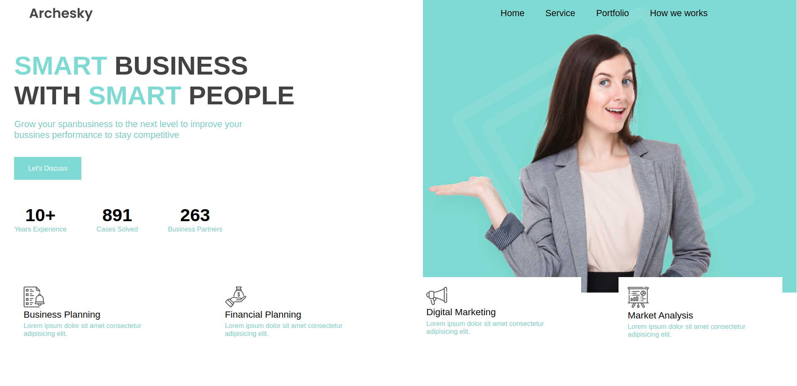

# Header Business Agency

 

## Descripción

**Header Business Agency** es un diseño de cabecera moderno y responsivo para agencias de negocios. Este proyecto forma parte de mi aprendizaje en desarrollo web y está diseñado para ser una sección reutilizable en proyectos más grandes.

## Tecnologías Utilizadas

- HTML5
- CSS3

## Características

✅ Diseño limpio y profesional<br>
✅ Fácil de integrar en otros proyectos<br>
✅ Código estructurado y bien documentado

## Instalación y Uso

1. Clona el repositorio:
   ```bash
   git clone https://github.com/jrramoncp/header_business_agency.git
   ```
2. Abre el archivo `index.html` en tu navegador o usa una extensión de Live Server en tu editor de código.


## Contacto

Si tienes alguna sugerencia o quieres colaborar en el proyecto, puedes encontrarme en:
- GitHub: [@jrramoncp](https://github.com/jrramoncp)
- Instagram: [@jrramoncp](https://www.instagram.com/jrramoncp/)

---

¡Gracias por visitar el repositorio! ⭐ Si te ha gustado el proyecto, no dudes en darle una estrella en GitHub.